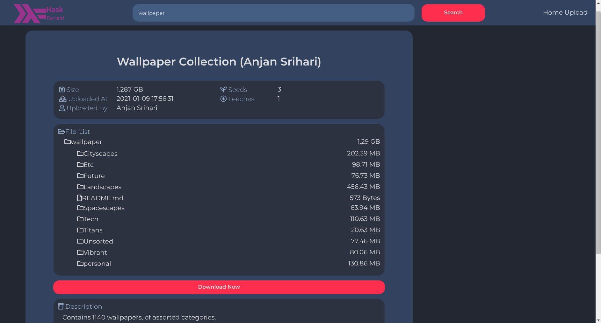

# HaskTorrent (B.Tech Minor Project: Aug '20)

[](https://youtu.be/TPgXMHi15TI)

## Introduction

This project implements a Complete P2P Torrent File Distribution System, providing 

- **HaskTracker:** A Torrent Tracking server, implemented in Haskell as per the BitTorrent Protocol, cross compatible with all commonly available [Torrent Clients](https://fossbytes.com/best-torrent-client-windows-free-torrent-downloaders/) 

- **HaskTorrent:** A Torrent MetaInfo Distribution API providing endpoints to upload/download .torrent files, fuzzy text search for torrents, as well as get detailed description of .torrent files. Implemented using Haskell and MongoDB.

- **hask-react:** A server-decoupled ReactJS frontend that utilizes the **HaskTorrent** API. 

Further Documentation for each Module can be found in their folders.

## Installation

### Database Setup

Install MongoDB, create a database with authentication.
Note the port on which mongo is running.

```
# In Mongo Shell 
> use torrentDB
> db.createCollection("torrents")
> db.createIndex({ 'ngrams':  'text'})
> db.createIndex({ 'infoHash': 1}, {unique: true})
```

Add the following environment variables to the ```~/.bash_profile```
and run ```source ~/.bash_profile```

```bash
# Any hostname would work, even localhost:port. 
# Necessary to specify port number
export TorrDBHostName="127.0.0.1:27018"  
# Name of the database created with authentication 
export TorrentDB="torrentDB"
# Name of the Collection used by the Libraries, do not change 
export TorrColl="torrents"
# Name of the username with readWrite privileges to $TorrentDB
export TorrDBUserName="user"
# Password for the same
export TorrDBPassWord="password"
```

## HaskTracker

Uses cabal.

```bash
cabal v2-build
cabal v2-run hask-tracker
```

## HaskTorrent

Uses Stack.

```bash
stack build
stack run
```

## hask-react

```bash
yarn install
yarn start
```
